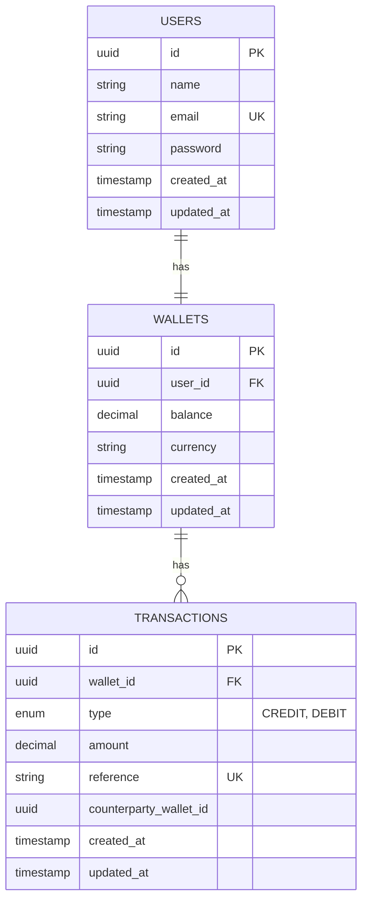

# Demo Credit MVP

## Overview
Demo Credit is a mobile lending app wallet service. This MVP allows users to create accounts, fund them, transfer funds, and withdraw. It integrates with Lendsqr Adjutor for Karma blacklist verification.

## Architecture
- **Language**: TypeScript (Node.js)
- **Framework**: Express
- **Database**: MySQL (Production), SQLite (Testing)
- **ORM/Query Builder**: Knex.js
- **Authentication**: JWT (Bearer Token)
- **Architecture Pattern**: Layered (Controller - Service - Data Access)

This architecture ensures separation of concerns, testability, and scalability. Services handle business logic and database transactions, while controllers handle HTTP requests.

## Design Decisions
1. **Knex.js**: Chosen for its flexibility and SQL control compared to heavier ORMs, allowing optimization of transactions.
2. **Transactions**: Critical for wallet operations (Fund, Transfer, Withdraw) to ensure data integrity (ACID properties). We use `db.transaction()` and `forUpdate()` (locking) to prevent race conditions.
3. **UUIDs**: Used for IDs to ensure uniqueness across distributed systems and security (harder to guess).
4. **Karma Integration**: Implemented as a service check during registration.

## Database Design (E-R Diagram)

## Setup
1. Clone the repository.
2. Run `npm install`.
3. Configure `.env` (see `.env.example`).
4. Run migrations: `npx knex migrate:latest`.
5. Start server: `npm start`.

## Testing
Run `npm test` to execute unit and integration tests.

## API Endpoints
- `POST /api/v1/users/register`: Register user.
- `POST /api/v1/users/login`: Login.
- `GET /api/v1/wallets`: Get wallet details.
- `POST /api/v1/wallets/fund`: Fund wallet.
- `POST /api/v1/wallets/transfer`: Transfer funds.
- `POST /api/v1/wallets/withdraw`: Withdraw funds.

## Deployment
Deployed on Heroku: [Link to Heroku App] (Placeholder)
Github Repo: [Link to Repo] (Placeholder)
